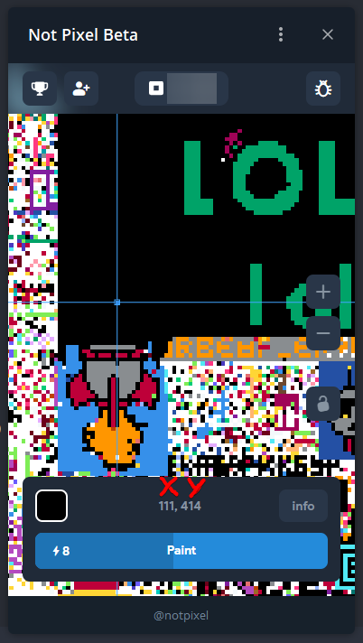
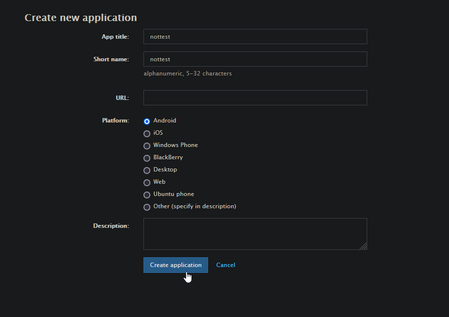
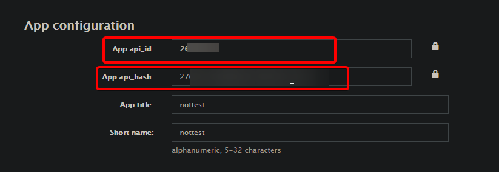
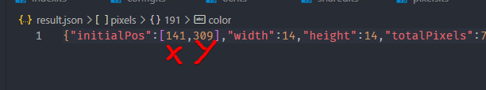

# notpx

> [!WARNING]
> Use at your own risk

**notpx** is a full-featured bot for NotPixel.

## Features:

1. Setting pixels at specified coordinates (coords in `result.json`)
2. Auto collection of tokens
3. Auto upgrade boosts
4. Auto use fast recharge boost if exists
5. Saving screenshots of the map (if necessary, additionally run the `bun run map` file)
6. Automatic image conversion to coordinates (Not all images are supported, read more below!!!)
7. Functions have been made for the entire NotPixel API, if something is missing in the bot, you can easily add it without even getting into the game itself

* All tasks are delayed. Every account has its own user agent
* The bot works linearly, i.e. it goes along the line until it finishes the cycle

**Have fun :)**

## Install

1. Install [Bun.sh](https://bun.sh)
2. Install dependencies:

```bash
bun install
```

3. Add sessions (read below)
4. Configure bot in the config in `src/config.ts`
5. Fill pixels data in `result.json` and set `initialPos`
6. Run:

```bash
bun start
```

7. (Optional) Run screenshoter:
```bash
bun map
```

## Configuration

### How to get coords?

The coordinates are above the button to set the pixel, the first coordinate is X, the second is Y.

E.g.: `111, 414` - 111 it's X, 414 it's Y.



### Authorization

You may have to manually launch the not pixel app for the 1st time

* auth data lifetime - ~30 min

#### Preparatory steps

1. Login to [my.telegram.org](https://my.telegram.org)
2. Go to "Api development tools"
3. Create new Application by filling in the fields as shown in the picture



4. Copy the `api_id` and `api_hash`



5. Insert `api_id` and `api_hash` to `.example.env`
6. Rename `.example.env` to `.env`

#### Login with Sessions

Supported Pyrogram and Telethon v1.x sessions

1. Create `sessions` folder near the package.json file (not in `./src`)
2. Place `.session` files in `./sessions` folder (not in `./src/sessions`)
3. Run `bun sessions:parse`
4. Done

#### Login with Phone number

1. Run `bun sessions:add`
2. Enter the required data in the console
3. Done

### Proxy

The bot supports only http and https proxies. I haven't tested it

1. Open `src/config.ts`
2. Add proxy string to `proxy` array

```ts
...
proxy: ["https://...:443", "http://...:8053"],
...
```

### How to convert image to coords?

> [!CAUTION]
> The image should be as clear as possible and have only the colors specified in the `src/types/pixels.ts` file (transparent supported).
> The resolution of the image must match the resolution of what you are drawing. If you want to draw 32x32, then the picture should also be 32x32, etc.
> Only `.png` is supported!

It is best if you draw the image in Figma and export it to `.png` there.

1. Copy your image to the parent folder and name it `result.png`
2. Run script:
```bash
bun ocr
```
3. Go to the `result.txt` file and check if the image looks right (sometimes it may look crooked, but the final result will be normal)
4. Set the coordinates to start drawing on the canvas in `result.json`:



In this example, change 141 to X coordinate, 309 to Y coordinate of canvas

5. Save the file

## About chances of being banned

Everything is at your own risk. I don't recommend using it on the main accounts.