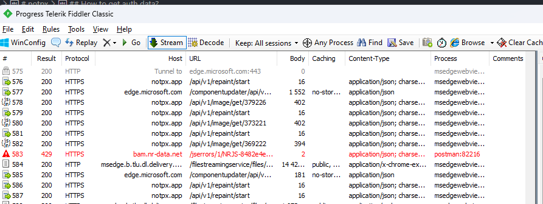
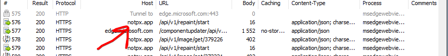
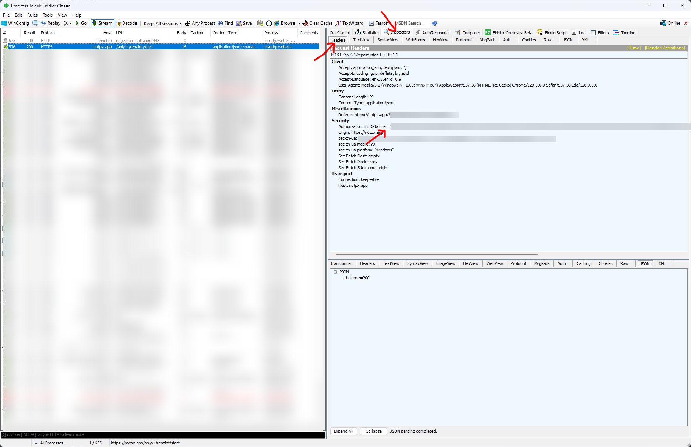
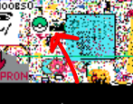

# notpx

> [!WARNING]
> Use at your own risk

**notpx** is a full-featured bot for NotPixel.

## Features:

1. Setting pixels at specified coordinates (coords in `result.json`)
2. Auto collection of tokens
3. Auto upgrade boosts
4. Saving screenshots of the map (if necessary, additionally run the `bun run map` file)
5. Automatic image conversion to coordinates (Not all images are supported, read more below!!!)
6. Functions have been made for the entire NotPixel API, if something is missing in the bot, you can easily add it without even getting into the game itself

* The bot works linearly, i.e. it goes along the line until it finishes the cycle

**Have fun :)**

## Install

1. Install [Bun.sh](https://bun.sh)
2. Install dependencies:

```bash
bun install
```

3. Fill auth data in the config in `src/config.ts`
4. Fill pixels data in `result.json` and set `initialPos`
5. Run:

```bash
bun start
```

6. (Optional) Run screenshoter:
```bash
bun map
```

## Configuration

### How to get coords?

The coordinates are above the button to set the pixel, the first coordinate is X, the second is Y.

E.g.: `111, 414` - 111 it's X, 414 it's Y.


### How to get auth data?

* auth data lifetime - 24 hours

#### Web Telegram

1. Login to Telegram Web
2. Open NotPixel bot
3. Click to start
4. Open devtools -> network
5. Find any request with Host is notpx.app and click on it LMB
6. Check Headers and find Authorization. Copy all after `initData` (without 1st space)

#### Telegram Desktop

1. Install [Fiddler Classic](https://www.telerik.com/fiddler/fiddler-classic)

2. Run and check if any requests appear on any site (allow the installation of the certificate if requested)



3. Run NotPixel in Telegram
4. Find any request with Host is `notpx.app` and click on it LMB



5. Go Headers and find Authorization. Copy all after `initData` (without 1st space)



6. Insert copied text to auth field in `src/config.ts`
```
auth: [
    "user=...",
    "user=...",
  ],
```

7. Set array of `http(s)` proxies if needed (I haven't tested it, it takes a random proxy from the array when requesting it)

### How to convert image to coords?

> [!CAUTION]
> The image should be as clear as possible and have only the colors specified in the `src/types/pixels.ts` file (transparent supported).
> The resolution of the image must match the resolution of what you are drawing. If you want to draw 32x32, then the picture should also be 32x32, etc.
> Only `.png` is supported!

It is best if you draw the image in Figma and export it to `.png` there.

1. Copy your image to the parent folder and name it `result.png`
2. Run script:
```bash
bun ocr
```
3. Go to the `result.txt` file and check if the image looks right (sometimes it may look crooked, but the final result will be normal)
4. Set the coordinates to start drawing on the canvas in `result.json`:


In this example, change 141 to X coordinate, 309 to Y coordinate of canvas

5. Save the file

## About chances of being banned

I have been checking the bot on several accounts for more than 48+ hours.

During this time, no restrictions were received.

All mining points have been counted, and the drawing is still intact as I returned to the computer.

It took about 4-5 hours to draw such a 16x16 (784 pixels) drawing with the participation of several accounts:



Keep in mind that everything you do, you do, only at your own risk. Have fun